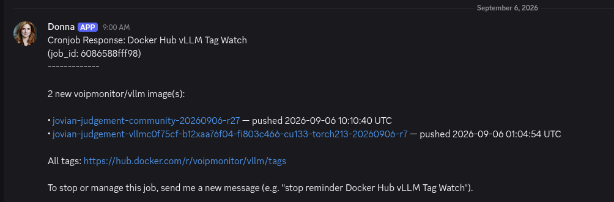

# Docker Hub vLLM Tag Watch — for RTX 6000 / RTX Pro 6000 owners

If you run vLLM on RTX 6000 or RTX Pro 6000 cards (solo or multi-GPU), you almost certainly pull the `voipmonitor/vllm` Docker image. That image gets rebuilt a lot — new CUDA builds, new kernels, FlashAttention updates, upstream vLLM bumps. Manually refreshing `docker pull` is a chore, and you only care when a *new* image is actually available.

This is a **zero-cost watcher** for exactly that. It polls the `voipmonitor/vllm` repo on Docker Hub, remembers every tag it has already seen, and **only alerts you when a genuinely new image pushes**. When nothing changed, it says nothing — so it costs nothing to run several times a day and never spams you.

Built as drop-in for the RTX 6000 community: **stdlib-only Python, no dependencies, no account, no API keys.** Drop it on any box next to your inference server and you're done.

---

## What it does

- Queries `hub.docker.com` for the newest `voipmonitor/vllm` tags every time it runs.
- Keeps a local SQLite DB of every tag previously seen.
- **Prints new tags only** — name, push time, and a link.
- **Prints nothing** when nothing is new (the "quiet tick" contract — perfect for cron).
- A failing fetch logs and exits quietly — a transient hub outage never pages you.

Example alert (Discord-friendly Markdown):



(The above is the expected alert format — a header line, one bullet per new tag with a link and timestamp, and a footer.)

---

## Requirements

- **Python 3** (stdlib only — `json`, `sqlite3`, `urllib`).
- Outbound network to `hub.docker.com`.
- A writable home dir for the state DB + log.

That's the whole list. Runs on Linux, macOS, WSL.

---

## Quick start

```bash
# 1. Get the script (from this repo/wiki article)
git clone <this-repo>   # or copy check_dockerhub_vllm_tags.py out of the code block

# 2. Seed the baseline — first run records all current tags
python3 check_dockerhub_vllm_tags.py

# 3. Confirm silence — run again, expect NO output (proves dedup works)
python3 check_dockerhub_vllm_tags.py

# 4. Add to cron — example: check at 09:00 and 21:00 daily
crontab -e
# add:
0 9,21 * * *  cd /path/to/folder && /usr/bin/python3 check_dockerhub_vllm_tags.py
```

From here on, you get a message **only when a new vLLM image pushes**. Empty output = nothing new = no notification.

> **First-run expectation:** the first run prints the full existing tag list once (that's the baseline seed). By design — run it a second time to confirm it's quiet again.

---

## Configuration

State defaults to `~/data/` (created on first run) unless you override with env vars — no editing needed.

| Setting | Default | Notes |
|---|---|---|
| Repo watched | `voipmonitor/vllm` | `REPO` constant — RTX 6000 community image |
| API URL | Docker Hub v2 tags endpoint | `VLLM_API` env override (for testing) |
| DB path | `~/data/vllm_tags.db` | `VLLM_DB` env override |
| Log path | `~/data/vllm_tags.log` | `LOG_PATH` constant |
| Max pages | `10` | `MAX_PAGES` — 100 tags/page, ~1000 scanned max |
| Timeout | `30s` | `REQUEST_TIMEOUT` |

**State = the DB only.** Delete or relocate `vllm_tags.db` and the next run re-seeds (prints every tag once, then goes quiet).

**Config lives in the script as constants + env overrides — don't hardcode a specific home into a shared copy.** The script defaults to `os.path.expanduser("~/data/vllm_tags.db")`, which is portable. Override via `VLLM_DB` / `VLLM_API` rather than editing the file.

---

## Testing (before you trust it)

Test the whole thing against a **local fake** — no real Docker Hub calls, no touching your real DB:

```bash
# terminal 1 — serve a fake tag list on port 8001
python3 test/serve.py 8001 &

# terminal 2 — hit it with a throwaway DB
VLLM_API="http://127.0.0.1:8001/tags" VLLM_DB=/tmp/vllm_test.db python3 check_dockerhub_vllm_tags.py   # expect 3 new tags
VLLM_API="http://127.0.0.1:8001/tags" VLLM_DB=/tmp/vllm_test.db python3 check_dockerhub_vllm_tags.py   # expect SILENCE (dedup works)
rm /tmp/vllm_test.db
```

`test/serve.py` is a tiny stdlib HTTP server that returns the fixture JSON for any path (the script appends `&page=<n>` to its API URL, so a plain static-file server won't work — this one swallows the query). `test/fixtures/tags.json` ships with the repo.

> ⚠️ Everything stays under `/tmp` during a test — your real DB is never written.

---

## Wire it into Hermes Agent / OpenClaw

Built to drop into either agent framework. This section is the handoff for an agent (or a human) — the exact steps to stand it up as a real, scheduled watcher.

### 1. Where the script goes

This folder is the **canonical / shareable copy** — don't edit files here for a live install; copy the script out.

| Framework | Live location of the script |
|---|---|
| **Hermes Agent** | `~/.hermes/scripts/check_dockerhub_vllm_tags.py` |
| **OpenClaw** | `~/.openclaw/scripts/` (create it if missing) |

```bash
# Hermes
cp check_dockerhub_vllm_tags.py ~/.hermes/scripts/
chmod +x ~/.hermes/scripts/check_dockerhub_vllm_tags.py

# OpenClaw
mkdir -p ~/.openclaw/scripts ~/.openclaw/data
cp check_dockerhub_vllm_tags.py ~/.openclaw/scripts/
chmod +x ~/.openclaw/scripts/check_dockerhub_vllm_tags.py
```

State (the DB) and the log live under the user's data dir, never next to the script: default `~/data/`, Hermes convention `~/agent_data/data/`, OpenClaw `~/.openclaw/data/`.

### 2. Verify BEFORE scheduling (non-negotiable)

Never schedule an unverified watcher. Local test harness first — **throwaway DB + local fake API**:

```bash
# terminal 1 — serve the fake tag list
python3 test/serve.py 8001 &

# terminal 2 — from this folder, with a throwaway DB:
VLLM_API="http://127.0.0.1:8001/tags" VLLM_DB=/tmp/vllm_test.db python3 check_dockerhub_vllm_tags.py
#   expect: 3 new voipmonitor/vllm image(s):  (fixture has 3 tags)
VLLM_API="http://127.0.0.1:8001/tags" VLLM_DB=/tmp/vllm_test.db python3 check_dockerhub_vllm_tags.py
#   expect: NO output  (proves dedup works — second run is silent)

rm /tmp/vllm_test.db
```

Then a **live smoke test** with real Docker Hub, throwaway DB:

```bash
VLLM_DB=/tmp/vllm_live.db python3 ~/.hermes/scripts/check_dockerhub_vllm_tags.py   # prints current tags (seeds)
VLLM_DB=/tmp/vllm_live.db python3 ~/.hermes/scripts/check_dockerhub_vllm_tags.py   # must be SILENT (dedup on real hub)
rm /tmp/vllm_live.db
```

`serve.py` ignores the `&page=` query — a plain file server would 404 on it, which is why `serve.py` exists.

### 3. Hermes Agent — no_agent cron (ideal pattern)

Register a **`no_agent`** job. The scheduler runs the script directly — **no LLM**, zero tokens, deterministic. Empty stdout = silent tick; non-empty = alert.

- Script must be in `~/.hermes/scripts/` and referenced by **bare filename only** (`check_dockerhub_vllm_tags.py`). Absolute paths/`~/`/`../` are rejected by the scheduler.
- `no_agent: true`, `deliver: origin` (posts to the origin channel only on output).
- Schedule `0 9,21 * * *` (daily 09:00 and 21:00 — when vLLM images typically push).

```json
cronjob(
    action="create",
    name="Docker Hub vLLM Tag Watch",
    schedule="0 9,21 * * *",
    script="check_dockerhub_vllm_tags.py",
    no_agent=True,
    deliver="origin",
)
```

> **Hermes gotcha:** under Hermes's scheduler, `~`/`$HOME` can be unreliable. If the first scheduled run doesn't create the DB where expected, pass `VLLM_DB` explicitly in the job's environment (e.g. to `~/agent_data/data/vllm_tags.db`). The `os.path.expanduser("~/data/...")` default works for normal/OpenClaw installs where `$HOME` is stable.

### 4. OpenClaw

Register a scheduled task that executes the watcher and delivers its stdout to the channel. Same quiet-tick contract: post **only** when stdout is non-empty. Point it at `~/.openclaw/scripts/check_dockerhub_vllm_tags.py`, set `VLLM_DB`/`VLLM_API` as needed. If the scheduler doesn't handle empty stdout cleanly, wrap zero output to send nothing.

### 5. Confirm end-to-end

1. Confirm the cron job exists with `next_run_at` set.
2. Manually trigger one run (Hermes: `hermes cron run <id>`); the FIRST run seeds the DB — it prints the full current tag list once. That's the baseline, not an alert.
3. Trigger a second run immediately — it **must produce no output**.
4. Only report it live after that. A single run cannot prove dedup.

If a real new tag appears on the next scheduled tick, the user gets the marked-up alert. That's the goal.

---

## What's in this folder

```
dockerhub-vllm-tag-watch/
├── README.md                      # this file
├── check_dockerhub_vllm_tags.py   # the watcher — stdlib only, ~140 lines
├── example-output.png             # screenshot of the expected alert format
└── test/
    ├── serve.py                   # fixture server (handles &page= query)
    └── fixtures/
        └── tags.json              # fake API response (3 tags, newest is new)
```

---

## Troubleshooting

- **First run prints the whole tag list** — that's the seed. Run it twice; the second run should be silent.
- **Never alerts** — check the DB exists at the configured path and that the `newest_pushed` watermark in the `meta` table advanced after a run.
- **Silent failures** — a transient hub outage logs `fetch failed page N` and exits cleanly (intended). Check the log.
- **Ran fine, suddenly exits** — verify network to `hub.docker.com` and that the DB path is still writable.
- **Hermes "Script not found"** — the file isn't in `~/.hermes/scripts/`, or the `script` field has a path instead of a bare filename.
- **Exit 127** — a stale/moved path in a wrapper, or a missing binary. Read the full stderr line before fixing.

---

## License

MIT.
